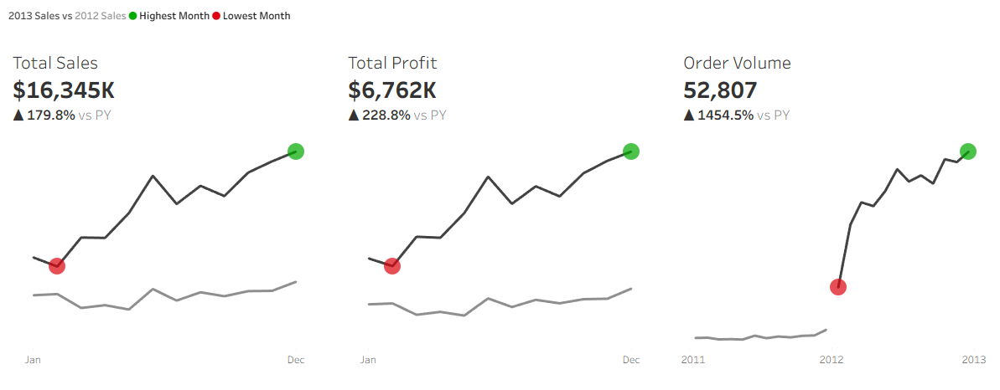
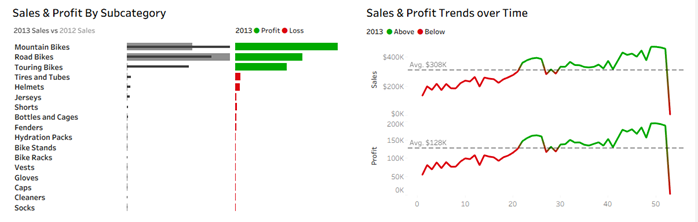
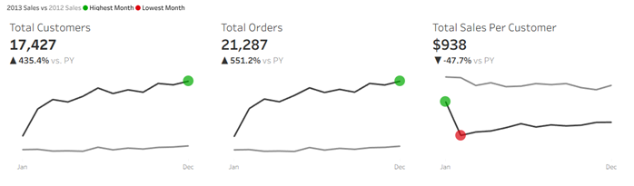
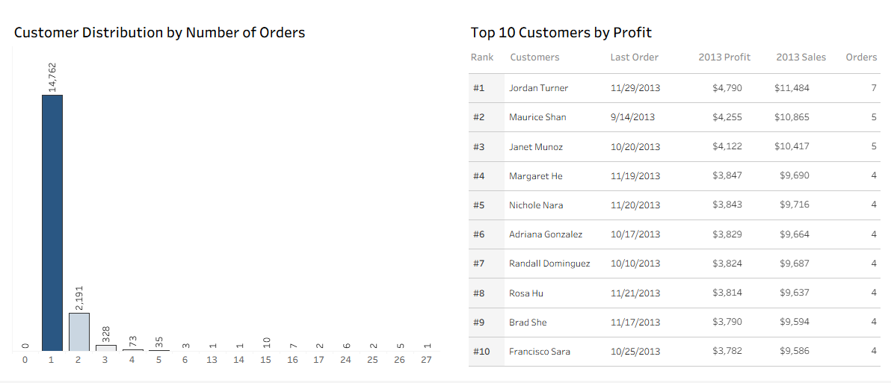

# Project Background

This project analyzes transactional sales data using **SQL Server** for data preparation and analytics, and **Tableau** for building interactive dashboards.
The goal is to help business stakeholders understand customer behaviour, product performance, and sales trends using a data-driven approach.

### Project Goals
* Clean, transform, and explore the data using SQL Server.
* Perform in-depth **Exploratory Data Analysis (EDA)** to uncover patterns and relationships.
* Generate **analytics queries** to support precise KPI’s development.
* Build customer and product insights to support marketing and operations teams.
* Develop interactive **Sales** and **Customer Dashboards** in Tableau to support executive-level decision-making.
  
The SQL performs data profiling to understand all aspects of the data.[view](scripts/1_Database.sql)

SQL queries generate reports that address various business questions.[view](scripts/3_Data_Analytics_Queries.sql)

SQL queries are utilized to clean, organize, and prepare data for the dashboard.[view](scripts/4_Cleaned_Data_Analysis.sql)

SQL creates a table or view for users or stakeholders to analyze for decision-making.[view](scripts/Customer_Reports.sql) [view](scripts/Product_Reports.sql)

An interactive Tableau Dashboard can be downloaded [here.](https://github.com/maryrosefarina-ui/Fabio-Bike-Sales/blob/main/Sales%20%26%20Customer%20Dashboard.twbx)

# Data Structure
The data follows a star-schema structure optimized for analytical use with a total row count of 60,398 records.

### Key Tables
* **fact_sales –**  measures: revenue, profit, order dates, quantity.
* **dim_customer –** demographic and customer profile information.
* **dim_product –** category, subcategory, product lines, cost.

The project uses **SQL Server** and **Tableau Desktop** to completely understand the datasets and ensure that insights from the analysis are based on solid foundations.

# Executive Summary

The Sales and Customer Dashboards provide a comprehensive view of business performance in 2010 to 2013, highlighting significant year-over-year growth in key metrics and offering clear insight into trends, customer behavior, and product profitability.

# Sales Performance Overview

The business experienced **strong YoY growth across all major sales KPIs:**
* **Total Sales:** $16.3M, up **179.8%** YoY
* **Total Profit:** $6.8M, up **228.8%** YoY
* **Order Volume:** 52,807 orders, a remarkable **1454.5%** YoY increase
  
In the year 2011, sales continued to spike significantly until 2013. Key performance indicators have all shown year-over-year increases in performing months. This increase can be attributed to prioritising target customers, stock availability, and promotional banners. 

Below is the overview snapshot from the Tableau Dashboard and performance throughout the report.

# Product Performance Overview

The Sales & Profit by Subcategory visual clearly differentiates between the top and bottom-performing product groups:
* **Mountain Bikes, Road Bikes, and Touring Bikes** drive most of the profit, showing strong margins and sales growth compared to the prior year.
* Lower-performing subcategories such as Helmets, Jerseys, and Gloves appear in red, indicating negative or below-average profit contribution.
  
This breakdown helps identify which product lines should receive increased investment and which may require pricing, cost, or inventory strategy adjustments.

### Trend Analysis
Weekly trend charts reinforce the monthly view by showing:
* Healthy upward momentum for most of the year
* Weekly fluctuations above and below average benchmarks
* A clear visual distinction **between sales averaging $308k and profit averaging $128k during strong and weak performance periods.**

This granularity provides operational teams with insight into promotional timing, inventory planning, and demand forecasting.

# Customer Performance Overview

### Customer Growth & Value
Customer metrics also show exceptionally strong YoY growth:
* **Total Customers:** 17,427, up **435.4%** YoY
* **Total Orders:** 21,287 units, up **551.2%** YoY
* **Total Sales per Customer:** $938, slightly declining YoY (–47.7%), indicating rapid customer growth outpacing average spending
  
This suggests that while the customer base is expanding quickly, retention and upsell programs could increase per-customer value.

 
### Customer Behavior
The Customer Distribution by Number of Orders highlights important behavioral insights:
* A large share of customers made only one purchase, indicating significant acquisition success but a potential retention opportunity.
* A smaller group of repeat purchasers drives disproportionately higher sales volume.

### Top 10 Customers
The Top 10 Customers by Profit highlight high-value individuals:
* Rankings include total sales, total profit, order count, and last order date.
* These customers contribute significantly to profitability, reinforcing the importance of segmentation and targeted outreach.

 
# Recommendations

* Focus on top-performing product categories by allocating more inventory and marketing to high-profit lines like Mountain and Road Bikes, while reviewing pricing and cost structures for underperforming subcategories to improve margins. 
* Strengthen customer retention, as many customers purchase only once—simple tactics like follow-up emails, loyalty rewards, and personalized offers can increase repeat orders and customer lifetime value. 
* Use seasonal and weekly trends to plan staffing, promotions, and inventory around predictable high and low demand periods.
* Prioritize high-value customers with targeted engagement and streamlined offers.

